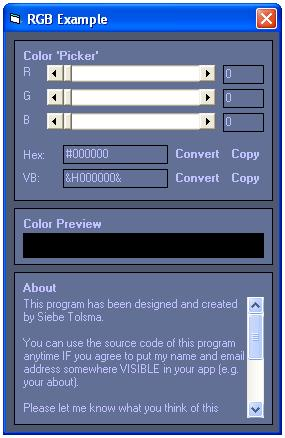



## \[\~\~ RGB Example \~\~\]

### Description

This nifty little program will show you how to use horizontal scrollbars to create an RGB color. The color will be 'convertet' to Hex (HTML) and the Visual Basic color code. Also, the color is being previewed in an picturebox.

--= UPDATE!! =--

I've made my program a little bit more attractive to the eye and also added 3 more functions! The user can now enter an Hex or VB color code and click 'convert'. The program will then convert the Hex or VB color code to the proper RGB values and Hex or VB color code :). A simple 'Copy to clipboard' funcion has been added to make it really easy to use the colors...
 
### More Info
 

             |
---                |---
**Submitted On**   |2003-06-21 16:40:04
**By**             |[Siebe Tolsma](https://github.com/Planet-Source-Code/PSCIndex/blob/master/ByAuthor/siebe-tolsma.md)
**Level**          |Beginner
**User Rating**    |4.7 (47 globes from 10 users)
**Compatibility**  |VB 6\.0
**Category**       |[Graphics](https://github.com/Planet-Source-Code/PSCIndex/blob/master/ByCategory/graphics__1-46.md)
**World**          |[Visual Basic](https://github.com/Planet-Source-Code/PSCIndex/blob/master/ByWorld/visual-basic.md)
**Archive File**   |[\[\~\~\_RGB\_Ex1604206212003\.zip](https://github.com/Planet-Source-Code/siebe-tolsma-rgb-example__1-46352/archive/master.zip)

